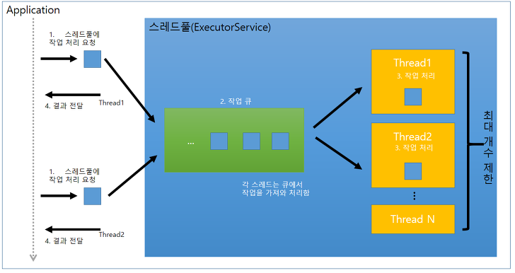

이 자료는 "에어콘" 사의 "자바 병렬 프로그래밍" 이라는 도서의 내용을 학습하면서 정리한 내용입니다. 예제로 제시된 소스코드 및 자세한 설명은 책을 참조하세요~ 

06. 작업 실행

- 애플리케이션이 해야 할 일을 작업( Task ) 라는 단위로 분할하면 프로그램의 구조를 간결하게 잡을 수 있고, 트랜잭션의 범위를 지정함으로써 오류에 효과적으로 대응할 수 있고, 작업 실행 부분의 병렬성을 자연스럽게 극대화 할 수 있다.

6.1. 스레드에서 작업 실행.
- 프로그램에서 일어나는 일을 작업이라는 단위로 재구성하고자 한다면 가장 먼저 해야 할 일은 작업의 범위를 어디까지로 할 것인지 정하는 일이다.

- 원론적으로 보자면 작업은 완전히 독립적인 동작을 말한다. 다른 작업의 상태, 결과, 부수 효과 등에 영향을 받지 않아야 한다는 이야기이다. 이런 독립성이 갖춰져 있어야 병렬성을 보장할 수 있다.

- 작업을 스케줄링하거나 부하 분산( load balancing ) 을 하고자 할 때 폭 넓은 유연성을 얻으려면 각 작업이 애플리케이션의 전체적인 업무 내용 가운데 충분히 작은 부분을 담당하도록 구성되어 있어야 한다.

6.1.1. 작업을 순차적으로 실행

- 단일 스레드로 처리하는 도중에는 어떤 작업에건 대기 상태에 들어간다는 의미가 단지 처리 시간이 길어진다는 문제뿐만 아니라 다른 요청을 전혀 처리하지 못한다는 문제가 발생한다.

- 단일 스레드에서 I/O 작업을 하는 동안 CPU 가 대기하고 있어야 하는 등 서버 하드웨어 자원을 제대로 활용하지 못한다는 문제도 있다.

- 특정 상황에서는 순차적인 처리 방법을 사용해 간결함과 안전성이라는 장점을 얻을 수도 있다. 대부분의 GUI 프레임웍에서 사용자의 이벤트를 처리할 단일 스레드에서 순차적으로 처리한다.

6.1.2. 작업마다 스레드를 직접 생성

- 반응 속도를 훨씬 높일 수 있는 방법 가운데 하나는 요청이 들어올 때마다 새로운 스레드를 하나씩 만들어 실행시키는 방법이다.

- 요청마다 스레드를 분리하면 다음과 같은 특징이 있다.
 1. 작업을 처리하는 기능이 메인 스레드에서 떨어져 나온다.
 2. 동시에 여러 작업을 병렬로 처리할 수 있기 때문에 두 개 이상의 요청을 받아 동시에 처리할 수 있다.
 3. 실제 작업을 처리하는 스레드의 프로그램은 동시에 동작할 가능성이 매우 높기 때문에 스레드 안전성을 확보해야 한다.

6.1.3. 스레드를 많이 생성할 때의 문제점

- 작업마다 스레드를 생성하는 정책은 상용 서비스에서 사용하기에는 무리가 있다. 왜냐하면 특정 상황에서 엄청나게 많은 대량의 스레드가 생성될 수도 있는데, 이럴 때는 아래와 같은 단점이 발생한다.

1. 스레드 라이프 사이클 문제 : 스레드를 생성하고 제거하는 작업에도 자원이 소모된다. 스레드를 생성하고 제거하는 데 실제로 얼마만큼의 자원을 소모하는지는 운영체제에 따라 다르지만, 어쨌거나 스레드를 생성하는 과정에는 일정량의 시간이 필요하다.

2. 자원 낭비 : 실행 중인 스레드는 시세틈의 자원, 특히 메모리를 소모한다. 하드웨어에 실제로 장착되어 있는 프로세서보다 많은 수의 스레드가 만들어져 동작 중이라면, 실제로는 대부분의 스레드가 대기(idle) 상탣에 머무른다. 이렇게 대기 상태에 머무르는스레드가 많아지면 많아질수록 많은 메모리를 필요로 하며, JVM 의 가비지 콜렉터에 가해지는 부하가 늘어날 뿐만 아니라 CPU 를 사용하기 위해 여러 스레드가 경쟁하는 모양이 되기 때문에 메모리 이외에도 많은 자원을 소모한다. 만약 시스템에 꽂혀 있는 CPU 의 개수에 해당하는 스레드가 동작 중이라면, 스레드를 더 만들어 낸다 해도 성능이 직접적으로 개선되지 않을 수 있으며 오히려 악영향을 미칠 가능성도 있다.

3. 안정성 문제 : 모든 시스템에는 생성할 수 있는 스레드의 개수가 제한되어 있다. 몇 개까지 만들 수 있는지는 플랫폼과 운영체제마다 다르고, JVM 을 실행할 때 지정하는 인자나 Thread 클래스에 필요한 스택의 크기에 따라서 달라지기도 한다. 만약 제한된 양을 모두 사용하고 나면 아마도 OutOfMemoryError 가 발생한다.

- 일정한 수준까지는 스레드를 추가로 만들어 사용해서 성능상의 이점을 얻을 수 있지만, 특정 수준을 넘어간다면 성능이 떨어지게 마련이다.
 

6.2. Executor 프레임웍
- 크기가 제한된 큐( bounded queue ) 를 사용해 부하가 크게 걸리는 애플리케이션에서 메모리를 모두 소모해 버리지 않도록 통제하는 방법이 있다. 스레드 풀( thread pool ) 은 스레드를 관리하는 측면에서 이와 같은 통제력을 갖출 수 있도록 해주며, java.util.concurrent 패키지를 보면 Executor 프레임웍의 일부분으로 유연하게 사용할 수 있는 스레드 풀이 만들어져 있다.

- Executor는 작업 등록( task submission ) 과 작업 실행 ( task execution ) 을 분리하는 표준적인 방법이며, 각 작업은 Runnable 형태로 정의한다.

- Executor 인터페이스를 구현한 클래스는 작업의 라이프 사이클을 관리하는 기능도 갖고 있고, 몇 가지 통계 값을 뽑아내거나 또는 애플리케이션에서 작업 실행 과정을 관리하고 모니터링하기 위한 기능도 갖고 있다.

- Executor 구조는 프로듀서-컨슈머 패턴에 기반하고 있으며, 작업을 생성해 등록하는 클래스가 프로듀서( 처리해야 할 작업을 생성하는 주체 )가 되고, 작업을 실제로 실행하는 스레드가 컨슈머( 생성된 작업을 처리하는 주체 ) 가 되는 모양을 갖추고 있다. 일반적으로 프로듀서 - 컨슈머 패턴을 애플리케이션에 적용해 구현할 수 있는 가장 쉬운 방법이 바로 Executor 프레임웍을 사용하는 방법이다.

6.2.1. 예제 : Executor 를 사용한 웹서버

- 스레드를 직접 생성하도록 구현되어 있는 상태에서는 동작 특성을 쉽게 변경할 수 없지만, Executor 를 사용하면, Executor의 설정을 변경하는 것만으로 쉽게 변경할 수 있다. Executor 에 필요한 설정은 대부분 초기에 한 번 지정하는 것이 보통이며 처음 실행하는 시점에 설정 값을 지정하는 편이 좋다. 하지만 Executor 를 사용해 작업을 등록하는 코드는 전체 프로그램의 여기저기에 퍼져있는 경우가 많기 때문에 한눈에 보기가 어렵다.

6.2.2. 실행 정책 ( Execution Policy )

- 작업을 등록하는 부분과 실행하는 부분을 서로 분리시켜두면 특정 작업을 실행하고자 할 때 코드를 많이 변경하거나 기타 여러 가지 어려운 상황에 맞닥뜨리지 않으면서도 실행 정책( execution policy )을 언제든지 쉽게 변경할 수 있다는 장점이 있다. 실행 정책은 다음과 같이 '무엇을, 어디에서, 어떻게' 실행하는지를 지정할 수 있다.

 * 작업을 어느 스레드에서 실행할 것인가?
 
 * 작업을 어떤 순서로 실행할 것인가? ( FIFO, LIFO, 기타 다양한 우선순위 정책 )
 
 * 동시에 몇 개의 작업을 병렬로 실행할 것인가?
 
 * 최대 몇 개까지의 작업이 큐에서 실행을 대기할 수 있게 할 것인가?
 
 * 시스템에 부하가 많이 걸려서 작업을 거절해야 하는 경우, 어떤 작업을 희생양으로 삼아야 할 것이며, 작업을 요청한 프로그램에 어떻게 알려야 할 것인가?
 
 * 작업을 실행하기 직전이나 실행항 직후에 어떤 동작이 있어야 하는가?
 
- 실행 정책은 일종의 자원 관리 도구라고 할 수 있다. 가장 최적화된 실행 정책을 찾으려면 하드웨어나 소프트웨어적인 자원을 얼마나 확보할 수 있는지 확인해야 하고, 더불어 애플리케이션의 성능과 반응 속도가 요구사항에 얼마만큼 명시되어 있는지도 알아야 한다.

프로그램 어디에서든 간에
 
 new Thread( runnable ).start()

와 같은 코드가 남아 있다면 조만간 이런 부분에 유연한 실행 정책을 적용할 준비를 해야 할 것이며, 나중을 위해서 executor 를 사용해 구현하는 방안을 심각하게 고려해봐야 한다.

6.2.3. 스레드 풀

- 스레드 풀( Thread Pool ) 은 이름 그대로 작업을 처리할 수 있는 동일한 형태의 스레드를 풀의 형태로 관리한다. 일반적으로 스레드 풀은 풀 내부의 스레드로 처리할 작업을 쌓아둬야 하기 때문에 작업 큐( work queue ) 와 굉장히 밀접한 관련이 있다.
 
- 작업 스레드는 아주 간단한 주기로 동작하는데, 먼저 작업 큐에서 실행할 다음 작업을 가져오고, 작업을 실행하고, 가져와 실행할 다음 작업이 나타날 때까지 대기하는 일을 반복한다.

- 풀 내부의 스레드를 사용해 작업을 실행하는 방법을 사용하면, 작업별로 매번 스레드를 생성해 처리하는 방법보다 굉장히 많은 장점이 있다. 매번 스레드를 생성하는 대신 이전에 사용했던 스레드를 재사용하기 때문에 스레드를 계속해서 생성할 필요가 없고, 따라서 여러 개의 요청을 처리하는 데 필요한 시스템 자원이 줄어드는 효과가 있다. 작업을 실행하는 데 딜레이가 발생하지 않아 전체적인 반응 속도도 향상되며, 스레드 풀의 크기를 적절히 조절해두면 하드웨어 프로세서가 쉬지 않고 동작하도록 할 수도 있다. 하으뒈어 프로세서가 바쁘게 동작하는 와중에도 메모리를 전부 소모하거나 여러 스레드가 한정된 자원을 두고 서로 경쟁하느라 성능을 까먹는 현상도 없앨 수 있다.

- 자바 클래스 라이브러리에서는 흔히 사용하는 여러 가지 설정 상태에 맞춰 몇 가지 종류의 스레드 풀을 제공한다. 미리 정의되어 있는 스레드 풀을 사용하려면 Executors 클래스에 만들어져 있는 다음과 같은 메소드를 호출하면 된다.

newFixedThreadPool : 처리할 작업이 등록되면 그에 따라 실제 작업할 스레드를 하나씩 생성한다. 생성할 수 있는 스레드의 최대 개수는 제한되어 있으며 제한된 개수까지 스레드를 생성하고 나면 더 이상 생성하지 않고 스레드 수를 유지한다. ( 만약 스레드가 작업 하는 도중 예상치 못한 예외가 발생해서 스레드가 종료되거나 하면 하나씩 더 생성하기도 한다. )

newCachedThreadPool : 캐시 스레드 풀은 현재 풀에 갖고 있는 스레드의 수가 처리할 작업의 수보다 많아서 쉬는 스레드가 많이 발생할 때 쉬는 스레드를 종료시켜 훨씬 유연하게 대응할 수 있으며, 처리할 작업의 수가 많아지면 필요한 만큼 스레드를 새로 생성한다. 반면에 스레드의 수에는 제한을 두지 않는다.

newSingleThreadExecutor : 단일 스레드로 동작하는 Executor로서 작업을 처리하는 스레드가 단 하나뿐이다. 만약 작업 중에 Exception 이 발생해 비정상적으로 종료되면 새로운 스레드를 하나 생성해 나머지 작업을 실행한다. 등록된 작업은 설정된 큐에서 지정하는 순서( FIFO, LIFO, 우선 순위 ) 에 따라 반드시 순차적으로 처리된다.

newScheduledThreadPool : 일정 시간 이후에 실행하거나 주기적으로 작업을 실행할 수 있으며, 스레드의 수가 고정되어 있는 형태의 Executor.Timer 클래스의 기능과 유사하다. 

- newFixedThread 와 newCachedThreadPool 팩토리 메소드는 일반화된 형태로 구현되어 있는 ThreadPoolExecutor 클래스의 인스턴스를 생성한다. 

- 처리할 작업을 execute 메소드로 등록해 두면, Executor 내부의 큐에 쌓이고, Executor 내부의 풀에 있는 스레드가 큐에 쌓여 있는 작업을 하나씩 뽑아내 처리하게 되어 있다.

- 작업별로 스레드를 생성하는 전략 ( thread-per-task ) 에서 풀을 기반으로 하는 전략 ( pool-based ) 로 변경하면 안전성 측면에서 엄청난 장점을 얻을 수 있다. 부하가 걸리더라도 더 이상 메모리가 부족해 죽는 일이 발생하지 않으며, 부하에 따라 수천 개의 스레드를 생성해 제한된 양의 CPU 와 메모리 자원을 서로 사용하려고 경쟁시키는 상황에 이르지 않기 때문에 성능이 떨어질 때도 점진적으로 서서히 떨어지는 특징을 갖는다.

- Executor 를 사용하면 사용하지 않을 때보다 성능을 튜닝하거나, 실행 과정을 관리하거나, 실행 상태를 모니터링하거나, 실행 기록을 로그로 남기거나, 오류가 발생했을 때 처리하고자 할 때 여러 가지 방법을 동원해 쉽고 효과적으로 처리하기가 좋다.

6.2.4. Executor 동작 주기

- JVM 은 모든 스레드가 종료되기 전에는 종료하지 않고 대기하기 때문에 Executor를 제대로 종료시키지 않으면 JVM 자체가 종료되지 않고 대기하기도 한다.

- Executor는 작업을 비동기적으로 실행하기 때문에 앞서 실행시켰던 작업의 상태를 특정 시점에 정확하게 파악하기 어렵다. 어떤 작업은 이미 완료됐을 수도 있고, 또 몇 개의 작업은 아직 실행 중일 수 있고, 또 다른 작업은 아직 큐에서 대기 상태에 머물러 있을 수도 있다. 애플리케이션을 종료하는 과정을 보면 안전한 종료 방법( graceful, 작업을 새로 등록하지는 못하고 시작된 모든 작업을 끝낼 때까지 기다림 ) 이 있겠고,또 한편으로는 강제적인 종료( abrupt, 예를 들어 플러그가 빠져 전원이 꺼지는 경우 ) 방법이 있겠다. 물론 안전한 종료 방법과 강제 종료 사이에 위치시킬 수 있는 여러 가지 종료 방법이 있다.

- 서비스를 실행하는 동작 주기와 관련해 Executor를 상속받은 ExecutorService 인터페이스에는 동작 주기를 관리할 수 있는 여러 가지 메소드가 추가되어 있다. ( 이와 함께 작업을 등록하는 방법도 몇 가지 더 갖고 있다. )

- 내부적으로 ExecutorService가 갖고 있는 동작 주기에는 실행 중(running), 종료 중(shutting down), 종료(terminated)의 세 가지 상태가 있다. ExecutorService를 처음 생성했을 때에는 실행 중 상태로 동작한다.

- 어느 시점엔가 shutdown 메소드를 실행하면 안전한 종료 절차를 진행하며 종료중 상태로 들어간다. 이 상태에서는 새로운 작업을 등록받지 않으며, 이전에 등록되어 있던 작업( 실행되지 않고 대기 중이던 작업도 포함 ) 까지는 모두 끝마칠 수 있다.

- shutdownNow 메소드를 실행하면 강제 종료 절차를 진행한다. 현재 진행 중인 작업도 가능한 한 취소시키고, 실행되지 않고 대기 중이던 작업은 더 이상 실행시키지 않는다.

- ExecutorService 의 하위 클래스인 ThreadPoolExecutor 는 이미 종료 절차가 시작되거가 종료된 이후에 새로운 작업을 등록하려 하면 실행 거절 핸들러( rejected execution handler ) 를 통해 오류로 처리한다. 실행 거절 핸들러에 따라 다르지만 등록하려 했던 작업을 조용히 무시할 수도 있고, RejectedExecutionException을 발생시켜 오류로 처리하도록 할 수도 있다. 

- 종료 절차가 시작된 이후 실행 중이거나 대기 중이던 작업을 모두 끝내고 나면 ExecutorService 는 종료 상태로 들어간다. ExecutorServicce가 종료 상태로 들어갈 떄까지 기다리고자 한다면 awaitTermination 메소드로 대기할 수도 있고, isTerminated 메소드를 주기적으로 호출해 종료 상태로 들어갔는지 확인할 수도 있다.

- 일반적으로 shutdown 메소드를 실행한 이후 바로 awaitTermination을 실행하면 마치 ExecutorService를 직접 종료시키는 것과 비슷한 효과를 얻을 수 있다.

6.2.5. 지연 작업, 주기적 작업

- 자바 라이브러리에 포함된 Timer 클래스를 사용하면 특정 시간 이후에 원하는 작업을 실행하는 지연 작업이나, 주기적인 작업을 실행할 수 있다. 하지만 Timer 는 그 자체로 약간의 단점이 있기 때문에 가능하다면 ScheduledThreadPoolExecutor 를 사용하는 방법을 생각해 보는 것이 좋다.

- ScheduledThreadPoolExecutor 를 생성하려면 직접 ScheduledThreadPoolExecutor 클래스의 생성 메소드를 호출해 생성하는 방법이 있고, 아니면 newScheduledThredPool 팩토리 메소드를 사용해 생성하는 방법이 있다.

- Timer 클래스는 등록된 작업을 실행시키는 스레드를 하나만 생성해 사용한다. 만약 Timer 에 등록된 특정 작업이 너무 오래 실행된다면 등록된 다른 TimerTask 작업이 예정된 시각에 실행되지 못할 가능성이 높다.

- ScheduledThreadPoolExecutor 를 사용하면 지연 작업과 주기적 작업마다 여러 개의 스레드를 할당해 작업을 실행하느라 각자의 실행 예정 시각을 벗어나는 일이 없도록 조절해준다.

- Timer 클래스의 또 다른 단점을 들자면, TimerTask 가 동작하던 도중에 예상치 못한 Exception 을 던져버리는 경우에 예측하지 못한 상태로 넘어갈 수 있다는 점이다. Timer 스레드는 예외 상황을 전혀 처리하지 않기 때문에 TimerTask 가 Exception 을 던지면 Timer 스레드 자체가 멈춰 버릴 가능성도 있다.

- Timer 클래스는 오류가 발생해 스레드가 종료된 상황에서도 자동으로 새로운 스레드를 생성해주지 않는다. 이런 상황에 다다르면, 해당 Timer에 등록되어 있던 모든 작업이 취소된 상황이라고 간주해야 하며, 그 동안 등록됐던 TimerTask 는 전혀 실행되지 않고 물론 새로운 작업을 등록할 수도 없다.

- 자바 5.0 이후의 버전을 사용하는 경우에는 통상 일부러 Timer 를 사용할 필요가 없으며, 만약 특별한 스케줄 방법을 지원하는 스케줄링 서비스를 구현해야 할 필요가 있다면, BlockingQueue 를 구현하면서 ScheduledThreadPoolExecutor 와 비슷한 기능을 제공하는 DelayQueue 클래스를 사용하는 것이 좋다. 

- DelayQueue 는 큐 내부에 여러 개의 Delayed 객체로 작업을 관리하며,각각의 Delayed 객체는 저마다의 시각을 갖고 있다. DelayQueue를 사용하며 Delayed 내부의 시각이 만료된 객체만 take 메소드로 가져갈 수 있다. DelayQueue에서 뽑아내는 객체는 객체마다 지정되어 있던 시각 순서로 정렬되어 뽑아진다.

6.3. 병렬로 처리할 만한 작업

6.3.1. 예제 : 순차적 페이지 렌더링

- 순차적인 방법은 CPU 의 능력을 제대로 활용하지 못하는 경우가 많으며, 사용자는 똑같은 내용을 보기 위해 불필요하게 많은 시간을 기다려야 한다.

- 처리해야 할 큰 작업을 작은 단위의 작업으로 쪼개서 동시에 실행할 수 있도록 한다면 CPU 도 훨씬 잘 활용할 수 있고, 처리 속도와 응답속도 역시 많이 개선할 수 있겠다.

6.3.2. 결과가 나올 떄까지 대기 : Callable 과 Future

- Runnable 을 들여다 보면 충분한 기능을 제공하지 못하는 경우가 많다. run 메소드는 실행이 끝난 다음 뭔가 결과 값을 리턴해 줄 수도 없고, 예외가 발생할 수 있다고 throws 구문으로 표현할 수도 없다. 만약 결과 값을 만들어 냈다면 어딘가 공유된 저장소에 저장해야 하고, 오류가 발생했다면 로그 파일에 오류 내용을 기록하는 정도가 일반적인 처리 방법이다.

- 결과를 받아올 때까지 시간이 걸리는 작업이 꽤나 많다. 데이터베이스에 쿼리를 보내 결과를 받는 경우도 그렇고, 네트웍상의 데이터를 받아오는 경우도 그렇고, 물론 아주 복잡한 계산을 하는 경우에도 그렇다. 이와 같이 결과를 얻는 데 시간이 걸리는 기능은 Runnable 대신 Callable 을 사용하는 게 모양새가 좋다.

- Callable 인터페이스에서는 핵심 메소드인 call 을 실행하고 나면 결과 값을 돌려받을 수 있으며, Exception 도 발생시킬 수 있도록 되어 있다. ( 결과 값을 리턴하지 않는 작업을 Callable 로 지정하려면 Callable<Void> 와 같이 표현한다.

- Executor 에는 Callable 뿐만 아니라 Runnable 이나 java.security.PrivilegedAction 등 여러 가지 유형의 작업을 실행할 수 있는 기능이 들어 있다.

-  Runnable 과 Callable 은 둘 다 어떤 작업을 추상화하기 위한 도구이다. Executor 에서 실행한 작업은 생성(created), 등록(submitted), 실행(started), 종료(completed)와 같은 네 가지의 상태를 통과한다.

- Executor 프레임웍에서는 먼저 등록됐지만 시작되지 않은 작업은 언제든지 실행하지 않도록 취소시킬 수 있다. 이미 시작한 작업은 그 내부 구조가 인터럽트를 처리하도록 잘 만들어져 있는 경우에 한해 취소시킬 수 있다.

- Future 는 특정 작업이 정상적으로 완료됐는지, 아니면 취소됐는지 등에 대한 정보를 확인할 수 있도록 만들어진 클래스이다.

- Future 가 동작하는 사이클에서 염두에 둬야 할 점은, 한 번 지나간 상태는 되돌릴 수 없다는 점이다. 사이클을 되돌릴 수 없다는 것은 ExecutorService 와 동일하다. 일단 완료된 작업은 완료 상태에 영원히 머무른다.

- get 메소드는 작업이 진행되는 상태( 시작되지 않은 상태, 시작된 상태, 완료된 상태 등 )에 따라 다른 유형으로 동작한다. 작업이 완료 상태에 들어가 있다면 get 메소드를 호출했을 때 즉시 결과 값을 리턴하거나 Exception 을 발생시킨다. 반면 아직 작업을 시작하지 않았거나 작업이 실행되고 있는 상태라면, 작업이 완료될 때까지 대기한다. 

- 작업 실행이 모두 끝난 상태에서 Exception 이 발생했었다면 get 메소드는 원래 발생했던 Exception 을 ExecutionException 이라는 예외 클래스에 담아 던진다. 작업이 중간에 취소됐다면 get 메소드에서 CancellationException 이 발생한다. get메소드에서 ExecutionException 이 발생한 경우 원래 발생했던 오류는 ExecutionException 의 getCause 메소드로 확인할 수 있다.

- 실행하고자 하는 작업을 나타내는 Future 클래스는 여러 가지 방법으로 만들어 낼 수 있다. ExecutorService 클래스의 submit 메소드는 모두  Future 인스턴스를 리턴한다. 따라서 Executor 에 Runnable 이나 Callable 을 등록하면 Future 인스턴스를 받을 수 있고, 받은 Future 인스턴스를 사용해 작업의 결과를 확인하거나 실행 도중에 작업을 취소할 수도 있다. 아니면 Runnable 이나 Callable 을 사용해 직접 FutureTask 인스턴스를 생성하는 방법도 있다. ( 알고 보면 FutureTask 자체가 Runnable 을 상속받고 있기 때문에 Executor 에 넘겨 바로 실행시킬 수도 있고, 아니면 run 메소드를 직접 호출해 실행시킬 수도 있다. )

- 자바 6부터는 ExecutorService 를 구현하는 클래스에서 AbstractExecutorService 에 정의된 newTaskFor 라는 메소드를 오버라이드 할 수 있도록 되어 있으며, newTaskFor 를 오버라이드해 등록된 Runnable 이나 Callable 에 따라 Future 를 생성하는 기능에 직접 관여할 수 있다.

- Executor 에 Runnable 이나 Callable 을 넘겨 등록하는 것은 Runnable 이나 Callable 을 처음 생성했던 스레드에서 실제 작업을 실행할 스레드로 안전하게 공개하는 과정을 거치도록 되어 있다. 이와 유사하게 Future 에 결과 값을 설정하는 부분 역시 작업을 실행했던 스레드에서 get 메소드로 결과 값을 가져가려는 스레드로 결과 객체를 안전하게 공개하도록 되어 있다.

6.3.3. 예제 : Future 를 사용해 페이지 렌더링
 
-  Future.get 메소드를 감싸고 있는 오류 처리 구문에서는 발생할 수 있는 두 가지 가능성에 모두 대응할 수 있어야 한다. 첫 번째는 Exception 이 발생하는 경우이고, 두 번째는 결과 값을 얻기 전에 get 메소드를 호출해 대기하던 메인 스레드가 인터럽트 되는 경우이다.

6.3.4. 다양한 형태의 작업을 병렬로 처리하는 경우의 단점

- 유사한 작업 가운데 훨씬 세부적인 작업으로 병렬성을 높이지 못하면, 전체적인 성능을 떨어뜨리는 결과를 가져올 수 있다.

- 다양한 종류의 작업을 여러 작업 스레드에서 나눠 처리하도록 할 떄는 나눠진 작업이 일정한 크기를 유지하지 못할 수 있다는 단점이 있다.

- 여러 개의 작업 스레드가 하나의 작업을 나눠 실행시킬 때는 항상 작업 스레드 간에 필요한 내용을 조율하는 데 일부 자원을 소모하게 된다. 따라서 작업을 잘게 쪼개는 의미를 찾으려면 병렬로 처리해서 얻을 수 있는 성능상의 이득이 이와 같은 부하를 훨씬 넘어서야 한다.

- 여러 종류의 작업을 병렬로 처리해 병렬성을 높이고자 노력하는 것은 상당한 양의 업무 부하가 될 수 있지만, 그 업무의 결과로 얻을 수 있는 이득에는 한계가 있음을 알아야 한다.

프로그램이 해야 할 일을 작은 작업으로 쪼개 실행할 떄 실제적인 성능상의 이점을 얻으려면, 프로그램이 하는 일을 대량의 동일한 작업으로 재정의해 병렬로 처리할 수 있어야 한다.

6.3.5. CompletionService : Executor 와 BlockingQueue 의 연합

- 처리해야 할 작업을 갖고 있고, 이 작업을 모두 Executor 에 등록해 실행시킨 다음 각 작업에서 결과가 나오는 즉시 그 값을 가져다 사용하고자 한다면, 등록한 각 작업별로 Future 객체를 정리해두고, 타임아웃에 0을 지정해 get 메소드를 호출하면서 결과가나왔는지를 폴링( polling ) 해 결과를 찾아올 수 있다. 하지만 이는 깔끔한 방법이 아니며, 이런 작업을 위해 미리 만들어져 있는 방법이 있는데, 이것이 바로 완료 서비스 ( Completion service ) 이다.

- CompletionService 는 Executor 의 기능과 BlockingQueue 의 기능을 하나로 모은 인터페이스이다. 필요한 Callable 작업을 등록해 실행시킬 수 있고, take 나 poll 과 같은 큐 메소드를 사용해 작업이 완료되는 순간 완료된 작업의 Future 인스턴스를 받아올 수 있다. CompletionService 를 구현한 클래스로는 ExecutorCompletionService 가 있는데, 등록된 작업은 Executor 를 통해 실행한다.

6.3.6. 예제 : CompoletionService 를 활용한 페이지 렌더링

- Future 가 단일 작업 하나에 대한 진행 과정을 관리한다고 할 때, CompletionService 는 특정한 배치( batch, 일괄 ) 작업을 관리하는 모습이다.

6.3.7. 작업 실행 시간 제한

- 간혼 실행 중인 작업이 일정한 시간이 지난 이후에도 종료되지 않고 결과를 받지 못했다면, 결과를 사용할 시간이 지나 더 이상 작업의 의미가 없을 경우도 있다. 이럴 때는 작업 결과를 그냥 버릴 수밖에 없다.

- 타임 아웃을 지정할 수 있는 Future.get 메소드를 사용하면 이와 같은 시간 제한 요구사항을 만족할 수 있다. 즉 결과가 나오는 즉시 리턴되는 것은 타임아웃을 지정하지 않는 경우와 같지만, 지정한 시간이 지나도 결과를 만들어 내지 못하면 TimeoutException 을 던지면서 실행이 멈추게 되어 있다.

- 시간이 제한된 상태에서 작업을 실행할 때 발생하는 두 번째 문제는 제한된 시간이 넘었을 때 해당 작업을 실제로 멈추도록 해서 더 이상 시스템의 자원을 소모하지 않도록 해야 한다는 점이다. 이 부분은 해당 작업 내부에서 스스로 얼마의 시간 안에 결과를 만들어 내야 하는지를 관리하고, 제한된 시간이 되면 스스로 작동을 멈추도록 해야 한다. 그렇지 않다면 제한된 시간이 넘었을 때 강제로 취소시키는 방법도 있다.

- Future 는 시간 제한을 걸어둔 get 메소드에서 TimeoutException 이 발생하면, 해당 Future 작업을 직접 취소시킬 수 있다. 애초에 작업을 구현할 때 취소할 수 있도록 만들었다면, 취소하는 즉시 더 이상 시스템 자원을 잡아먹지 않고 깔끔하게 멈춘다.

6.3.8. 예제 : 여행 예약 포털

- 작업 n개를 생성해 스레드 풀에 등록하고, 등록한 작업마다 Future 객체를 확보하고, 타임아웃을 지정한 get 메소드로 각각의 정보를 가져오도록 하는 작업이 많이 쓰인다. 이런 작업을 더 쉽게 만들어 주는 기능이 있는데, 바로 invokeAll 메소드이다.

- invokeAll 메소드는 작업 객체가 담긴 컬렉션 객체를 넘겨받으며, 그에 해당하는 Future 객체가 담신 컬렉션 객체를 리턴한다. 물론 인자로 넘긴 작업 컬렉션과 결과로 받은 Future 컬렉션은 그 구조가 같다. invokeAll 메소드는 넘겨받은 작업 컬렉션의 iterator 가 뽑아주는 순서에 따라 결과 컬렉션에 Future 객체를 쌓는다.

- 시간 제한이 있는 invokeAll 메소드는 등록된 모든 작업이 완료됐거나, 작업을 등록한 스레드에 인터럽트가 걸리거나, 지정된 제한 시간이 지날 때까지 대기하다가 리턴된다. 제한시간이 지날 때가지 실행 중이던 작업은 모두 실행이 취소된다. invokeAll 메소드가 리턴되면 등록된 모든 작업은 완료되어 결과 값을 가지고 있거나 취소되거나 두 가지 상태 가운데 하나이다.

요약
- 애플리케이션을 작업이라는 단위로 구분해 실행할 수 있도록 구조를 잡으면 개발 과정을 간소화하고 병렬성을 확보해 병렬성을 높일 수 있다. 

- Executor 프레임웍을 사용하면 작업을 생성하는 부분과 작업을 실행하는 부분을 분리해 실행 정책을 수립할 수 있으며, 원하는 형태의 실행 정책을 쉽게 만들어 사용할 수 있다. 

- 작업을 처리하는 부분에서 스레드를 생성하도록 되어 있다면, 스레드를 직접 사용하는 대신 Executor 를 사용해보자. 

- 애플리케이션이 하는 일을 개별 작업으로 구분해 처리할 때는 작업의 범위를 적절하게 잡아야 한다. 웬만한 애플리케이션에서는 일반적인 작업 범위가 잘 적용되지만, 일부 애플리케이션에서는 스레드를 사용해 병렬로 처리시킨 이득을 보려면 약간의 분석을 통해 병렬로 처리할 작업을 찾아낼 필요가 있다.

출처: http://aroundck.tistory.com/881#recentTrackback [돼지왕 왕돼지 놀이터]